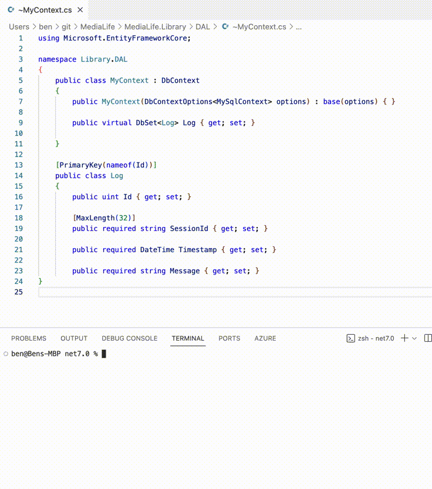

# DBContextSync

Synchronise your database with your Entity Framework (EF) C# DBContext class files.

Obviously EF has migrations to keep your 'code-first' or 'database-first' projects up to date.  But what if you start with the database, then want to make changes in the code and sometimes tweak the database again; and want to keep the classes and physical databases in sync.

DBContextSync clearly shows you the differences between your classes and database, allows you to select what you want to do.

See the example video below (*note, some command line arguments are hard coded for privacy*)

<p align="center">
  
</p>

## Run on the command line

Clone the code, and from within the project folder (`./DbContextSync`) run:

```shell
dotnet run -d <db_connection_string> -c <context_class_path>
```

Before actually copying tables and fields, you will be prompted various questions.  Answers to all the questions can be pre-set via arguments to allow running without interruption.

## Arguments

### Required Arguments

`-d` or `--database`    The database connection string.

`-c` or `--context`    [Glob](https://learn.microsoft.com/en-us/dotnet/core/extensions/file-globbing) file path pattern to the `DbContext` class and the table class files. (e.g. `./Library/DAL/**/*.cs`)

### Optional Arguments

`--count`    Add this argument to return only the count of changes.

`--preview`    Add this argument to return only the change preview.

`--contextclass=<class_name>`    If the `--context` class path provided contains multiple `DbContext` classes you will be asked which to use.  Provide this argument with the name of the class (`<class_name>`) to skip the question.

`--databasetype=MySql`    The database type should be derived from the connection string, but can be set here if required.  Currently only supports `MySql`.

`--direction=[ToDbContext | ToDatabase | ToDatabaseWithDeletes]`    Sets the copy direction without being asked.

`--noconfirm`    Start the copy process with confirming.

`--noconfirmdelete`    If the direction is `ToDatabaseWithDeletes` (and the copy would result in deletes from the database), you will be asked to double check you know what's happening.  Set this to skip over the question.

`--script`    If direction is `ToDatabase` or `ToDatabaseWithDeletes`, include this argument to output the sql scripts to the console.

`--scriptfile=<file_path>`    If the `script` argument is provided, sql scripts will be output to the console.  Supply a `file_path` to save the scripts to the path.

## Database Types

Currently only MySql is supported.

PR's welcome for other types; hopefully adding additional database types will be straight forward.
